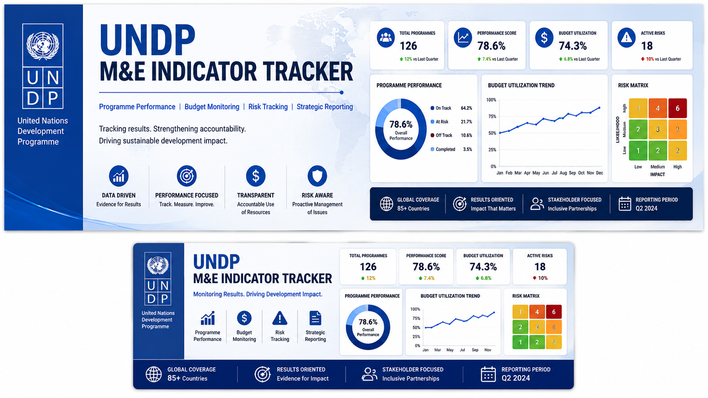
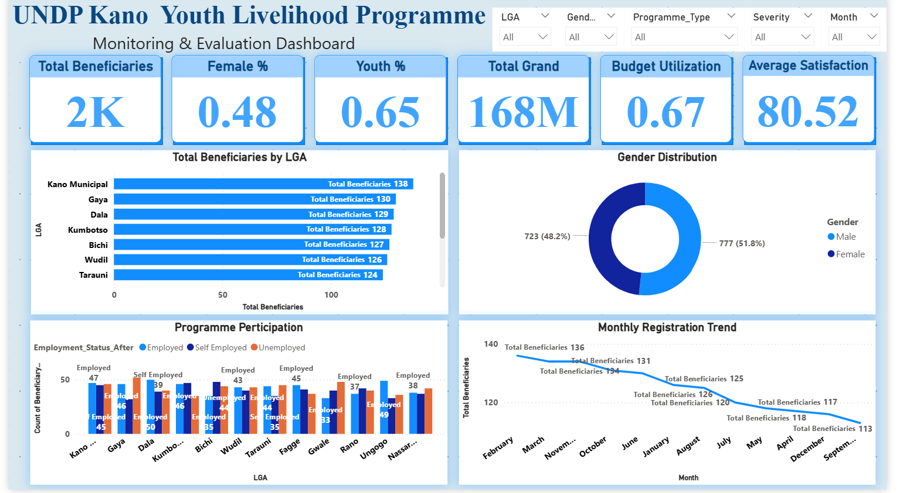
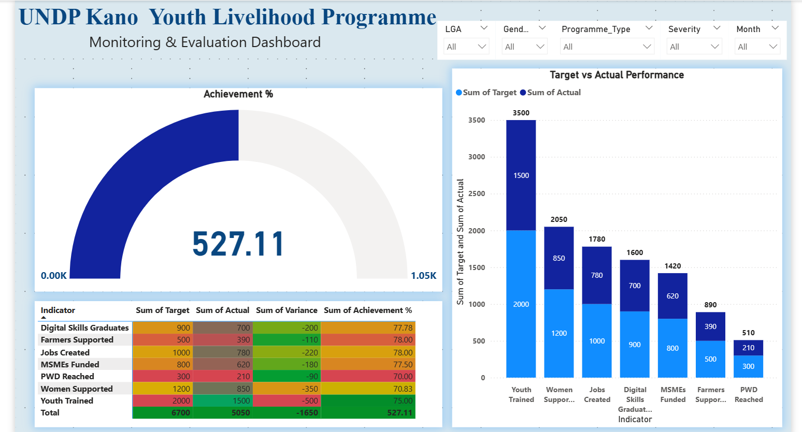
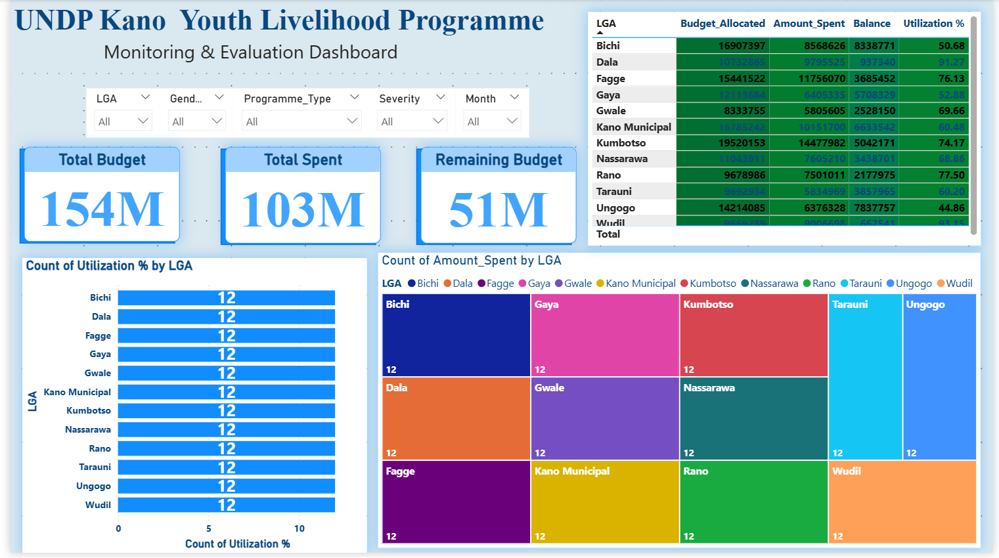
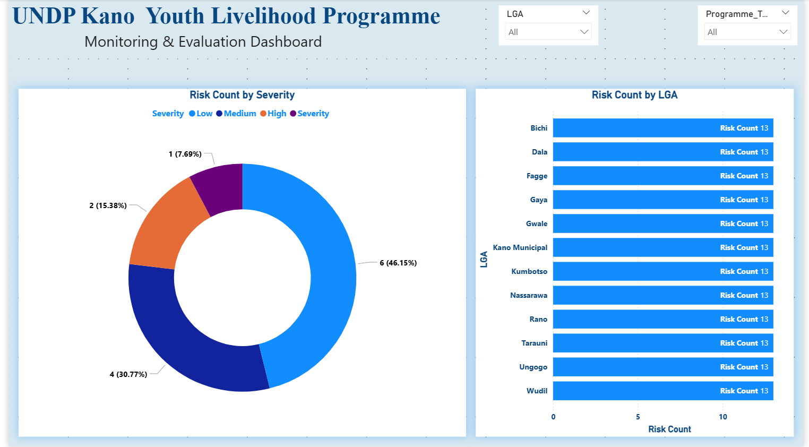

# undp-me-indicator-tracker

# UNDP M&E Indicator Tracker


---

## Project Overview

The UNDP M&E Indicator Tracker is a strategic monitoring dashboard designed to track programme implementation performance, budget utilization, and operational risks across multiple interventions.

The solution transforms complex programmatic data into actionable performance intelligence for evidence-based decision-making, accountability, and results-based management.

---

## Business Problem

Development programs often face major challenges in:

- Tracking KPI performance across interventions  
- Monitoring budget utilization efficiency  
- Identifying implementation bottlenecks  
- Escalating operational risks early  
- Producing timely management reports  

Without centralized monitoring, decision-making becomes slower and less effective.

---

## Project Objectives

This dashboard was built to:

- Monitor programme KPIs  
- Track implementation progress  
- Analyze budget performance  
- Identify operational risks and issues  
- Support strategic reporting  

---

## Dataset Information

| Metric | Value |
|-------|-------|
| Domain | Monitoring & Evaluation |
| Organization Type | UNDP-style Programme Dataset |
| Dataset Type | Simulated / Portfolio Dataset |
| Format | Excel |
| Dashboard Tool | Power BI |

---

## Tools Used

- Microsoft Excel  
- Power BI  
- Power Query  
- Data Cleaning Techniques  
- Dashboard Design  
- M&E Reporting  

---

## Data Cleaning Process

The following preprocessing steps were performed:

- Removed duplicate records  
- Standardized programme categories  
- Cleaned missing values  
- Corrected KPI inconsistencies  
- Validated budget figures  
- Structured analytical model for Power BI  

---

## Dashboard Preview

### Executive Overview


### Programme Performance


### Budget Monitoring


### Risk and Issues


---

## Key Insights

### 1. Programme Performance Variability
Some interventions consistently outperformed targets while others lagged behind.

### 2. Budget Utilization Gaps
Budget absorption varied significantly across programmes.

### 3. Emerging Operational Risks
Multiple risk indicators suggested potential implementation delays.

### 4. Strategic Priority Areas
Certain projects required closer monitoring and escalation.

---

## Recommendations

Based on the analysis:

- Prioritize underperforming programmes  
- Improve budget utilization efficiency  
- Strengthen issue escalation mechanisms  
- Enhance KPI review cycles  
- Improve risk mitigation planning  

---

## Deliverables

✔ Interactive Power BI Dashboard  
✔ Cleaned Dataset  
✔ Project Summary PDF  
✔ Analytical Report  
✔ Presentation Deck  
✔ Portfolio Case Study  

---

## Repository Structure

```bash
undp-me-indicator-tracker/
│
├── data/
├── docs/
├── dashboard/
├── presentation/
└── assets/
```

---

## Business Impact

This dashboard demonstrates how analytics strengthens monitoring and evaluation by converting raw programme data into strategic insights for performance management, accountability, and evidence-based reporting.

---

## Author

**Umar Musa Isah**  
Data Analyst | Monitoring & Evaluation Professional | Dashboard Specialist

Email: umarmusapress@gmail.com  
GitHub: https://github.com/UmarMusaIsah

## Portfolio Navigation

🔗 Master Portfolio: https://github.com/UmarMusaIsah/data-analytics-portfolio

---

> Turning programme data into strategic decisions.
